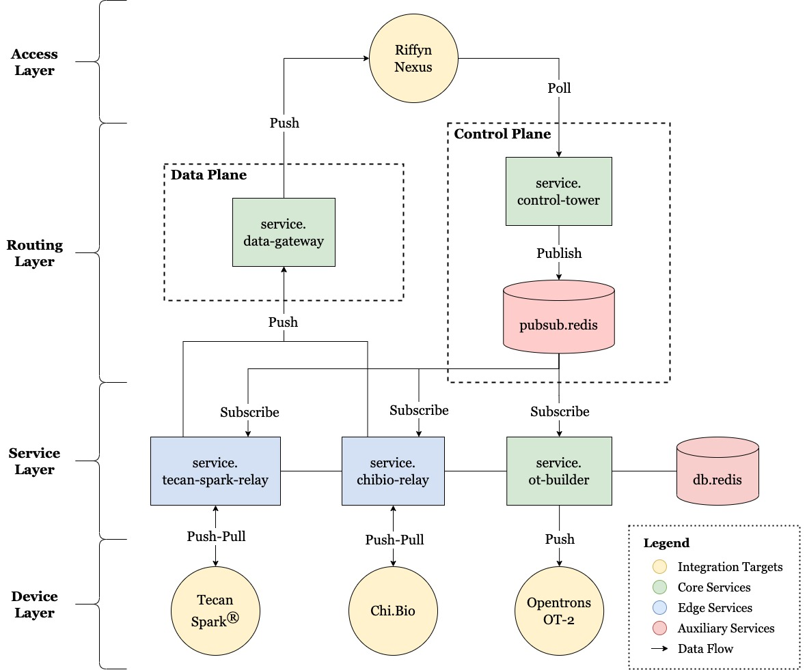

# Architecture

ULAS is built as a set of microservices to form the backbone that integrates various lab equipment and tools into a single platform. Each service has a single domain of responsibility and they communicate over the network to enable data to flow between them. You can find out more about each service through their respective README's. They can be broadly categorised into [core and edge services](#core-and-edge-services). There also exists auxiliary services that play complimentary roles in the overall system architecture such as databases, caches, message queues, etc.

The system operates on an internal data language called [protocols](protocols.md) that are represented as JSON objects. These are the messages sent to downstream automation targets that encapsulates the "instructions" on what operations to carry out at each step of the workflow.

These integrations essentially form the "building blocks" that allow one to compose lab automation workflows in steps that span across multiple integrations. Additionally, the sharing of data within the system means that the outputs from one step can be used as inputs for subsequent steps, allowing one to create cohesive workflows.

For instance, one can design a lab automation workflow that performs measurements on a plate via a plate reader, followed by using those measurements to carry out liquid transfers via a liquid handling robot, all within the same framework. Through integrating with laboratory information management systems, this workflow design process can be enhanced even further. A good example of this is using [Riffyn Nexus](https://riffyn.com/) to design the steps of an experiment in the model of a directed-acylic graph.

Below is a diagram of the current software architecture, which can be further divided into 4 layers.

### Access Layer

The access layer is the user-facing layer that allows users to design experimental workflows as well as capture experimental data. This is typically done through integrating with external software such as laboratory information management systems that provide powerful user interfaces for managing the lifecycle of experiments. Good examples are [Riffyn Nexus](https://riffyn.com/) and [Benchling](https://www.benchling.com/). There can be more than one integrations plugged into the lab automation system, and they can all work simultaneously.

While one would typically use the same integration for both designing experimental workflows and capturing experimental data, it is not strictly necessary. It is entirely feasible to have one software for workflow design (such as Riffyn Nexus), and another for data capture (such as an AWS S3 bucket). This however, means that data might not be able to flow from one step to the next, making it harder to build cohesive workflows.

You can also use your own custom software for the access layer, as long as it exposes an API that can be used by the routing layer. See below for more details.

### Routing Layer

The routing layer is responsible for moving data to the right places within the system, and is further broken down into the control plane and data plane.

The control plane is responsible for watching for specific events from integrations in the access layer and generating [protocol triggers](protocols.md#protocol-triggers) based on those events. An example of an event is a user initiating an `experiment` in the Riffyn Nexus UI. These triggers are then sent to downstream services in the service layer via a publish-subscribe mechanism, where [Redis](https://redis.io/) is used as the message queue in this architecture. Downstream services subscribed to Redis will then receive the protocol trigger and be able to respond accordingly. To watch for events in the access layer, a plugin that integrates with the desired API needs to be provided to the [`service.control-tower`](../services/control-tower). It is up to the plugin to handle how events are watched - through long polling, webhooks, etc.

The data plane is responsible for forwarding data from the service layer back up to the access layer. Services in the service layer that need to export data can send them to the [`service.data-gateway`](../services/data-gateway) via a HTTP request, which will then forward them to upstream destinations through its plugins. Similar to above, these plugins need to integrate with the API of the desired destination in the access layer.

### Service Layer

The service layer consists of the services that integrate with downstream automation targets in the device layer. These services are subscribed to the message queue and are responsible for responding accordingly to protocol triggers for protocols that they implement.

Essentially, these services are responsible for executing protocols propagated from upstream by controlling the underlying device, either through APIs, files systems, hardware, etc. These services also respect the protocol `spec` to customise the execution of protocols.

Additionally, the service layer also contains auxiliary services that are internally depended upon by other services. This is usually in the form of databases, caches, etc. In the current architecture, Redis is being used a cache by several services.

### Device Layer

The device layer consists of the automation targets to be integrated into the lab automation system via service layer integrations. These devices are the "workers" that carry out the actual execution of protocols in a workflow, such as liquid handling robots, plate readers, microcontrollers, etc.

Contrary to its name, a "device" doesn't strictly refer to physical hardware. The term is used to encompass software, firmware as well as hardware. In fact, most devices used with the lab automation system have some of each aspect (ie. software that controls some hardware).

## Core and Edge Services

Core services are services that can run anywhere in the cloud or on-premise servers as they do not rely on any local or physical integrations. These services can be deployed together using the Docker Compose setup covered in the [Getting Started](getting-started.md) guide.

Edge services on the other hand, are those that typically require access to physical hardware, a local API or file system, and are thus required to be run peripherally on their respective machines alongside the device they are interfaced with.
