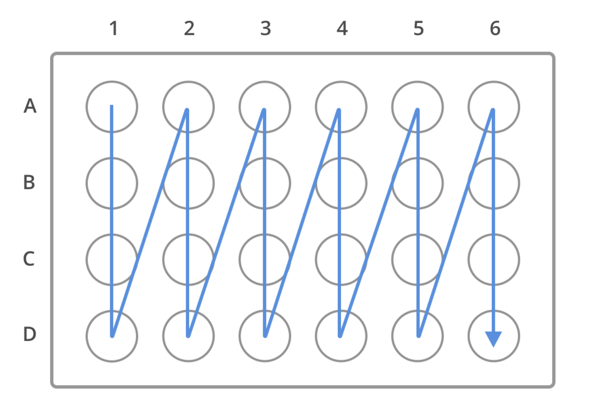

# Protocols

Protocols, in the context of the lab automation system, are the set of operations that can be performed by services in the service layer - you can think of them as pre-defined "functions" that a downstream target service is able to understand and execute. A protocol is represented as a JSON object that encapsulates all the information needed for a target service to execute it. Similar to functions in code, one is able to pass in parameters to customise how the protocol should be executed - this is done through the protocol `spec`, which is explained below.

The specifics of how a protocol is executed is entirely up to the target service implementing that protocol - the implementation can be seen as the "instructions" or logic carried out by the service. For example, a liquid handling robot might have a `SerialDilution` protocol while a plate reader might have a `MeasureAbsorbance` protocol, but different liquid handling robots and plate readers would have different implementation logic for how to execute these protocols.

While the implementation of a protocol can be as complex as you want, each protocol should typically be a distinct unit of actions that focuses on a specific responsibility. By combining multiple protocols together, these modular building blocks allow one to construct more complex lab automation workflows that span multiple devices.

The list of supported protocols for each service is documented in their respective README's. The set of operations that a service is able to perform can be extended by implementing more protocols to be handled.

## Protocol Triggers

While a protocol defines the blueprint of the operation to be executed, a protocol trigger is an instance of a protocol that downstream target services actually receive and handle. One can think of protocols as a "class" and protocol triggers as "objects" (ie. instance of a class).

Protocol triggers are what powers the lab automation system - they are sent as JSON objects to the message queue, which is then forwarded to downstream services. When a downstream service receives a trigger for a protocol it implements, it can then react accordingly by executing the respective protocol logic.

This protocol system essentially creates a common language such that new integrations can be easily added to the system as long as they are able to respond to triggers for protocols they implement. This communication interface based on JSON messages also makes it easy to change the way protocol triggers are generated without affecting downstream services. It does not matter how or where a protocol trigger is generated, as long as they have are published to the message queue - this is the underlying mechanism for how the plugin-based [`service.control-tower`](../services/control-tower) works.

## Protocol APIs

A service might support one or more protocol APIs, where each API exposes a set of available protocols that can be invoked.

This is the current list of services and the API versions they support:

- [`service.ot-builder`](../services/ot-builder)
  - `OT-2/v1alpha1`
- [`service.chibio-relay`](../services/chibio-relay)
  - `ChiBio/v1alpha1`
- [`service.tecan-spark-relay`](../services/tecan-spark-relay)
  - `TecanSpark/v1alpha1`

## Protocol Schema

A protocol trigger should essentially contain the following fields in its JSON body:

- `apiVersion`: the API version of the target service. To support multiple devices, one can add a named suffix to the API version. See the section on [Working with Multiple Devices](#working-with-multiple-devices) for more info.
- `protocol`: the name of a protocol (supported by the API) to be invoked, typically in pascal-case.
- `plate (optional)`: additional metadata for plate-based protocols. See the section on [plate-based protocols](#plate-based-protocols) for more info.
- `spec`: a JSON object containing the parameters for the specified protocol. This is the core of a protocol trigger and allows one to customise how the protocol is executed. The `spec` fields will depend on the schema of the specified protocol - check the documentation of the protocol for what parameters are supported. For plate-based protocols, this should be a list of JSON objects instead, one for each corresponding well index. See [plate-based protocols](#plate-based-protocols).
- `metadata (optional)`: a JSON object containing additional metadata about the protocol trigger. See the section on [metadata](#metadata) for more info.

#### Metadata

The `metadata` field of a protocol trigger is used to contain arbitrary data that could provide additional context about how or where the trigger was generated. This information can be queried and used by other services where necessary.

Schema for the `metadata` object:

- `source`: the name of the trigger source
- `spec`: a JSON object that can contain any arbitrary fields. For plate-based protocols, the `spec` object should be a list - one for each corresponding well index.

Example of a `metadata` object:

```json
{
  "source": "riffyn",
  "spec": {
    "experimentId": "experiment ID",
    "activityId": "activity ID",
    "runId": "run ID"
  }
}
```

#### Example

This is a complete example of a protocol trigger:

```json
{
  "apiVersion": "ChiBio/v1alpha1/ChioBio1",
  "protocol": "Bioreactor",
  "spec": {
    "devicePosition": "M0",
    "deviceName": "Hydrogen",
    "od": 0.42,
    "volume": 50,
    "thermostat": 38.8,
    "fp1Excite": "6500K",
    "fp1Gain": "8x"
  }
}
```

## Working with Multiple Devices

It is entirely likely that you will have more than one of the same device in your lab that you want to use with the lab automation system. You can achieve this by running multiple instances of the service for that integration - one for each device.

However, running multiple instances of a service means that they will all respond to the same protocol trigger - this is probably not behaviour that you want. To solve this, you can namespace the multiple devices by suffixing an additional name to the API version.

For example, if you have multiple Tecan Spark® plate readers, you can namespace them as `TecanSpark/v1alpha1/Spark1` and `TecanSpark/v1alpha1/Spark2`. This way, when you wish to invoke a protocol on a specific device, you can provide the fully qualified API version suffixed with the device name.

## Plate-Based Protocols

Some protocols might require you to work with a plate that contains multiple wells. To support this behaviour, you can specify a list of `spec` objects instead. Each `spec` object is associated to a well at its corresponding index.

The convention for indexing the wells on a plate starts from 0 and increases column-first, always starting from the top left corner and ending in the bottom right corner. See the image below for a clearer illustration:

<p align="center">
  
</p>

This means that if you have a 96-well plate (`8x12`), `A1` will correspond to well index 0. `B1` will be 1, and so on until 95.

Below is an example of a protocol trigger for operating on 4 wells, from `A1` to `D1`.

```json
{
  "apiVersion": "OT-2/v1alpha1",
  "protocol": "SimpleDilution",
  "plate": {
    "rows": 4,
    "columns": 1
  },
  "spec": [
    {
      "volume": 150 // A1
    },
    {
      "volume": 150 // B1
    },
    {
      "volume": 100 // C1
    },
    {
      "volume": 100 // D1
    }
  ]
}
```

When working with `metadata`, its `spec` object for plate-based protocols follows the same rules.
