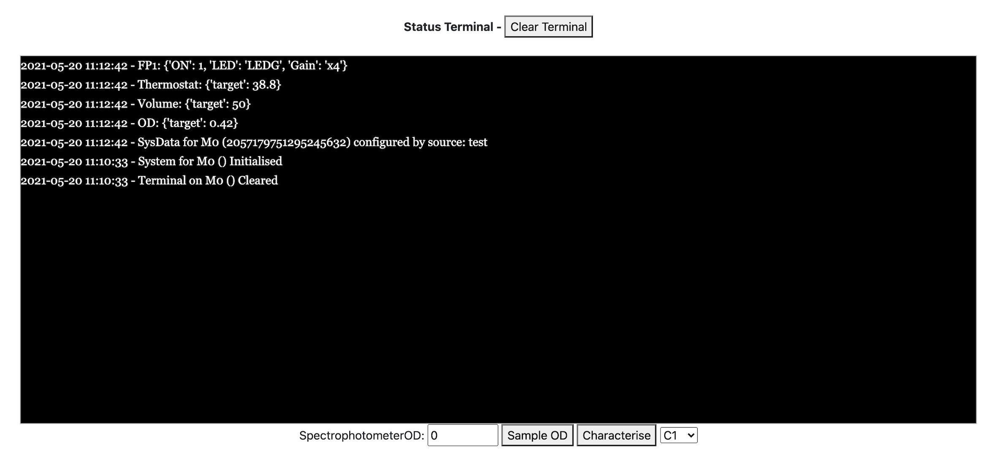
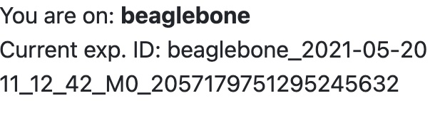

# `service.chibio-relay`

The `service.chibio-relay` is the service layer for interacting with a [Chi.Bio](https://chi.bio/) system through an API exposed by its HTTP server.

**Note that this currently only works with a fork of the Chi.Bio software. This fork can be found at https://github.com/jace-ys/ChiBio/tree/develop.**

## Minimum Requirements

- `python 3.9`
- `poetry 1.0`

You will also require a local instance of the Chi.Bio server. See this [guide](../../docs/development.md#externalchibio-server) for more info.

## Usage

- Install dependencies:

  ```
  poetry install
  ```

- Start auxiliary containers:

  ```
  make dependencies
  ```

- Export the following environment variables to the current shell:

  ```
  export MANAGER_CHIBIO_SERVER_URL=<base URL for the Chi.Bio server>
  export MANAGER_DEVICE_NAME=<a unique name for the current device>
  export FORWARDER_DATA_DIR=<the relative path to the Chi.Bio server's data directory>
  export FORWARDER_DATA_GATEWAY_URL=<the base URL for the data-gateway service>
  ```

  Other environment variables that can be configured can be found in [`src/config/config.py`](src/config/config.py).

- Run the server:

  ```
  make
  ```

## How it Works

Upon receiving a protocol trigger, the `service.chibio-relay` forwards the parameters in the protocol's spec via a POST request to the `/sysData` endpoint. This configures the settings for an experiment for the specified device position on the Chi.Bio (`M0`-`M8`). The updated parameters should be visible in the Chi.Bio UI and terminal.



The `service.chibio-relay` also creates an experiment to be executed via the `/Experiment/{device}` endpoint - you should see an experiment ID in the top left corner of the Chi.Bio UI. A user is still required to start and stop the experiment manually via the UI as this ensures that the Chi.Bio doesn't start running until a user is present to supervise it, which otherwise might pose some safety risks.

<p align="center">
  
</p>

Additionally, the `service.chibio-relay` uses this experiment ID to keep track of the corresponding CSV data file generated by the Chi.Bio server. It watches for this file, periodically parses it, and forwards any new data to the `service.data-gateway`. This allows for real-time streaming of experimental data while an experiment is running on the Chi.Bio.

## Protocols

The `service.chibio-relay` currently only has one protocol named `Bioreactor`. The spec for this protocol is detailed below:

- `devicePosition (string)`: device position from M0 to M8
- `deviceName (string)`: name of device (eg. Hydrogen, Lithium)
- `od (float)`: target value to use for OD regulation
- `volume (float)`: volume in _ml_
- `thermostat (float)`: target value for thermostat
- `fp1Excite (string)`: value for the FP 1 Excite setting
- `fp1Gain (string)`: value for the FP 1 Gain setting

Examples of protocol triggers for the `service.chibio-relay` can be found under [`protocols/examples/chibio-relay`](../../protocols/examples/chibio-relay).

## Data Export

The `service.chibio-relay` forwards data produced by the Chi.Bio to the `service.data-gateway` in the following format:

```json
{
  "timeElapsed": "time elapsed",
  "error": "error",
  "odMeasured": "OD measured",
  "odSetpoint": "OD setpoint",
  ...
}
```

The full list of exported data parameters is reflected in [`src/forwarder/payload.py`](src/forwarder/payload.py).

## Development

#### Adding New Spec Parameters

To add new parameters to the `Bioreactor` protocol spec, you will need to modify the code in [`src/system/manager.py`](src/system/manager.py). You should also have a look at the source code for the ChiBio server to see how the `sysData` object can be configured.
