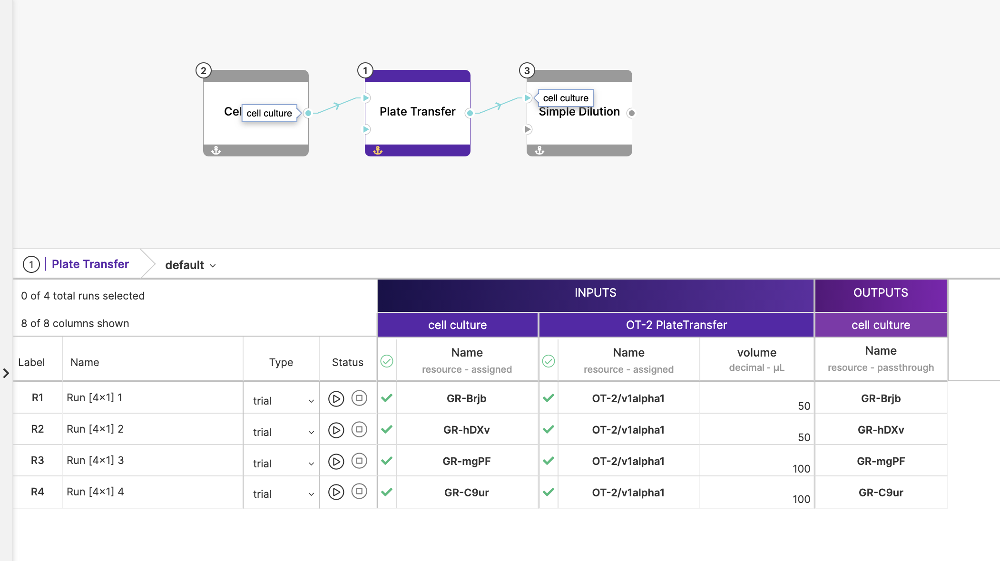

# `plugin.riffyn`

This plugin is an integration with the Riffyn API that polls Riffyn `experiments` for `runs` that have been `started` and converts its `input resources` into protocol triggers, with a `spec` generated from their `property` values, as long as they meet the required shape. This protocol trigger is then published to the message queue via the `service.control-tower`.

As the Riffyn API currently does not provide any support for webhooks, the plugin has to continuously poll the API at fixed intervals. This means that upon starting a `run`, it might take a few seconds before the protocol trigger is generated. You will also need to stop a `run` for a few seconds before it can be restarted to generate a new protocol trigger. This delay is determined by the `PLUGIN_RIFFYN_POLL_INTERVAL` environment variable.

## Configuration

The following environment variables need to be configured for the plugin:

```
export PLUGIN_RIFFYN_API_KEY=<your Riffyn API key>
```

Other environment variables for the plugin that can be configured can be found in [`src/config/config.py`](src/config/config.py).

## How it Works

The plugin continuously polls the Riffyn API at fixed intervals for all `experiments` and their `runs`, thereafter selecting all `runs` in the `started` state that have not yet been handled. It also keeps track of all `runs` that are in the `stopped` state for bookkeeping.

For each of these `runs`, it will iterate through its list of `input resources` and select the ones with a `resource name` that follows the API versioning convention (eg. `ChiBio/v1alpha1`). A protocol trigger is generated for each unique API version found, with its name set to the name of the `activity` converted to pascal-case (ie. `Serial Dilution` -> `SerialDilution`). If the name of an `input resource` does not meet the API versioning convention, it is ignored.

The `spec` of these protocol triggers are populated using the `properties` of their associated `input resources` - the name of the `property` is converted to camel-case and its value is assigned to it. For example, a `property` of `measurement wavelength` with value `600` is added to the `spec` as a key-value pair of `"measurementWavelength": 600`. Multi-valued input is currently not supported.

Note that for [plate-based protocols](../../../../docs/protocols.md#platebased-protocols), the plugin will aggregate over a specifed number of `runs` to build a list of protocol `spec` objects instead. This behaviour can be triggered by naming `runs` with the following syntax: `<name of run> [row x columns] <well index>`. For example, to aggregate over 4 wells in a 96-well plate, you should name your `runs` like so:

```
Run [4x1] 1
Run [4x1] 2
Run [4x1] 3
Run [4x1] 4
```

`4x1` here refers to the wells in the 1st 4 rows of the 1st column according to the well indexing conventions for plate-based protocols. You will also need to start all these `runs` together. As aggregated `runs` are unique to each `activity`, you do not need to worry about conflicting names across `activities`.



To illustrate the points discussed, the set of aggregated `runs` as seen in the above screenshot of a Riffyn `experiment` should result in the following protocol trigger being generated when all 4 runs have been started:

```json
{
  "apiVersion": "OT-2/v1alpha1",
  "protocol": "PlateTransfer",
  "plate": {
    "rows": 4,
    "columns": 1
  },
  "spec": [
    {
      "volume": 50
    },
    {
      "volume": 50
    },
    {
      "volume": 100
    },
    {
      "volume": 100
    }
  ]
}
```
