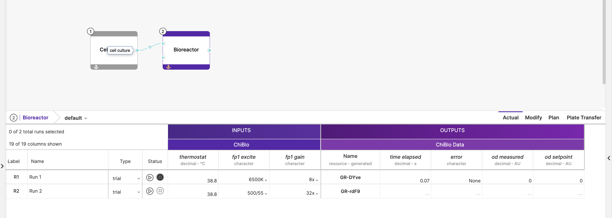

# `plugin.riffyn`

This plugin is an integration with the Riffyn API that allows data to be pushed to `runs` in a Riffyn `experiment`. It includes support for multi-valued data.

## Configuration

The following environment variables can be set to configure the plugin:

```
export PLUGIN_RIFFYN_API_KEY=<your Riffyn API key>
export PLUGIN_RIFFYN_CONTROL_TOWER_URL=<base URL for the service.control-tower>
```

## How it Works

Upon receiving a set of data rows to be forwarded to Riffyn, the plugin first queries the [`service.control-tower`](../../../control-tower) to obtain metadata about the original trigger that is associated with the data. This metadata object should look something like:

```json
{
  "source": {
    "name": "riffyn",
    "spec": {
      "experimentId": "ID of the associated experiment",
      "activityID": "ID of the associated activity",
      "runID": "ID of the associated run"
    }
  }
}
```

**Note that for well-based protocols, the spec will be a list of nested objects corresponding to each well index.**

The plugin uses these IDs to push data to the respective `run`. **Note that the plugin will populate the last (right-most) `output resource` of the `run`, so you will need to design your `process` in a way that corresponds with this behaviour.**

For each data row, the plugin first creates an `event` (ie. row) for the run using the primary key (first data column of the `output resource`), followed by uploading the rest of the data points to the newly created row. As a result, if the first key of the data row sent to the `service.data-gateway` does not correspond to the name of the output's first data column (in camel-case), the data will fail to be forwarded.

For the below example, the first key of each data row needs to be `timeElapsed`. Subsequent keys will be `error`, `odMeasured` and `odSetpoint`.


