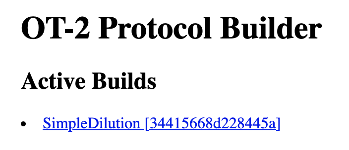
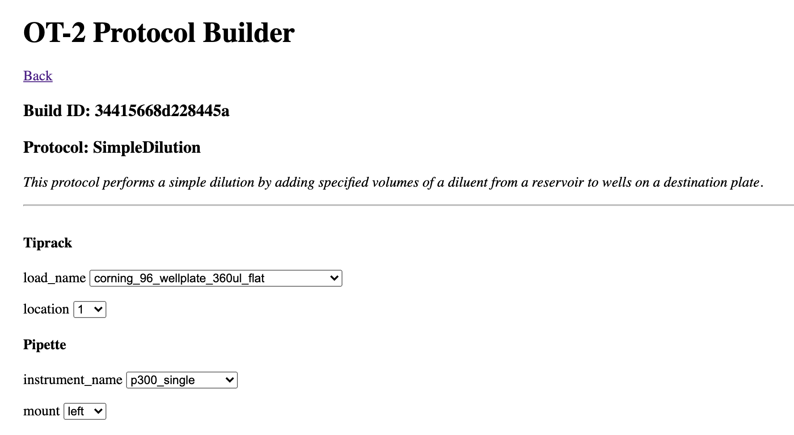

# `service.ot-builder`

The `service.ot-builder` is the service layer for working with the [Opentrons OT-2](https://opentrons.com/ot-2/) liquid handling robot. It does not actually interface directly with the robot, but instead runs as a standalone web server that is able to generate [OT-2 Python protocols](https://docs.opentrons.com/v2/writing.html) that can be uploaded to the OT-2 via the [Opentrons App](https://opentrons.com/ot-app/).

The `service.ot-builder` works as a unidirectional service - it only handles upstream triggers but does not actually export any data to the `service.data-gateway`.

## Minimum Requirements

- `python 3.9`
- `poetry 1.0`

## Usage

- Install dependencies:

  ```
  poetry install
  ```

- Start auxiliary containers:

  ```
  make dependencies
  ```

- Run the server:

  ```
  make
  ```

  The web frontend should be accessible at http://localhost:8000/builds.

  Environment variables for the server that can be configured can be found in [`src/config/config.py`](src/config/config.py).

## How it Works

Upon receiving a protocol trigger, the `service.ot-builder` registers an active OT-2 Python protocol build which can be accessed via the web frontend.

<p align="center">
  
</p>

Clicking into a build allows you to select the operational configuration required for the OT-2 to execute the protocol, such as the labware loaded onto the OT-2 deck and their respective locations. See the [OT-2 API docs](https://docs.opentrons.com/v2/new_labware.html?highlight=deck) for more info about labware.



Once you have selected the configuration for the protocol you wish to run on the OT-2, you can view a step-by-step simulation of what the OT-2 will execute before downloading the generated protocol file. This allows you to tweak the configuration until you are confident it will work. You can then have the OT-2 execute this protocol file by uploading it via the Opentrons App.

## Protocols

Available protocols can be found under the [`src/protocols`](src/protocols) directory. Each protocol contains a README documenting the required spec to trigger it.

Examples of protocol triggers for the `service.ot-builder` can be found under [`protocols/examples/ot-builder`](../../protocols/examples/ot-builder).

## Development

#### Adding New Protocols
